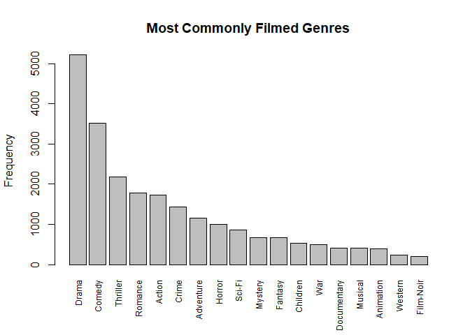
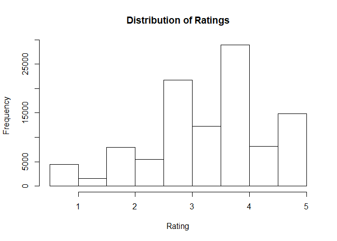
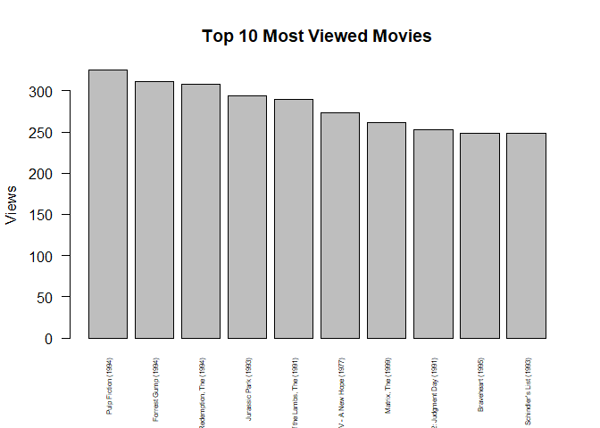
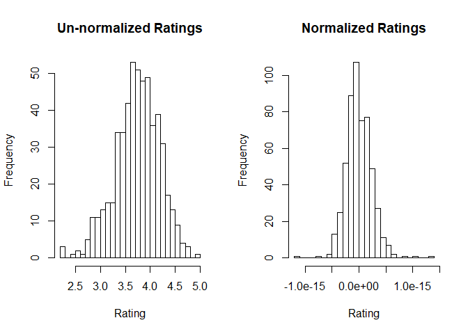

Movie Recommendation System
================
Jared Thach
3/11/2021

# Synopsis:

#### Introduction and Objective

#### Conclusion

#### Methods Used

  - Data Cleaning / Pre-Processing
  - Data Visualization
  - User-Based Collaberative Filtering

#### Technologies

  - R Programming
      - `recommenderlab`

#### Contributors

  - Jared Thach - github/jared8thach

# Table of Contents

1)  <a href='#Sec 1'>Importing Libraries and Data</a>
2)  <a href='#Sec 2'>Data Cleaning / Pre-Processing</a>
3)  <a href='#Sec 3'>Exploratory Data Analysis</a>
    1.  <a href='#Sec 3-1'>Most Commonly Filmed Genres</a>
    2.  <a href='#Sec 3-2'>Distribution of Ratings</a>
    3.  <a href='#Sec 3-3'>Top 10 Most Viewed Movies</a>
4)  <a href='#Sec 4'>Data Cleaning / Pre-Processing (cont’d.)</a>
5)  <a href='#Sec 5'>Building the Model</a>
6)  <a href='#Sec 6'>Evaluating Performance</a>
7)  <a href='#Sec 7'>Conclusion</a>

-----

# 1\) <a id='Sec 1'>Importing Libraries and Data</a>

``` r
# importing packages
library(recommenderlab)
# library(ggplot2)
library(data.table)
library(reshape2)
```

``` r
# importing movie and rating data
movies = read.csv('data/movies.csv', stringsAsFactors=FALSE)
ratings = read.csv('data/ratings.csv')

head(movies)
```

    ##   movieId                              title
    ## 1       1                   Toy Story (1995)
    ## 2       2                     Jumanji (1995)
    ## 3       3            Grumpier Old Men (1995)
    ## 4       4           Waiting to Exhale (1995)
    ## 5       5 Father of the Bride Part II (1995)
    ## 6       6                        Heat (1995)
    ##                                        genres
    ## 1 Adventure|Animation|Children|Comedy|Fantasy
    ## 2                  Adventure|Children|Fantasy
    ## 3                              Comedy|Romance
    ## 4                        Comedy|Drama|Romance
    ## 5                                      Comedy
    ## 6                       Action|Crime|Thriller

``` r
head(ratings)
```

    ##   userId movieId rating  timestamp
    ## 1      1      16    4.0 1217897793
    ## 2      1      24    1.5 1217895807
    ## 3      1      32    4.0 1217896246
    ## 4      1      47    4.0 1217896556
    ## 5      1      50    4.0 1217896523
    ## 6      1     110    4.0 1217896150

``` r
summary(movies)
```

    ##     movieId          title              genres         
    ##  Min.   :     1   Length:10329       Length:10329      
    ##  1st Qu.:  3240   Class :character   Class :character  
    ##  Median :  7088   Mode  :character   Mode  :character  
    ##  Mean   : 31924                                        
    ##  3rd Qu.: 59900                                        
    ##  Max.   :149532

``` r
summary(ratings)
```

    ##      userId         movieId           rating        timestamp        
    ##  Min.   :  1.0   Min.   :     1   Min.   :0.500   Min.   :8.286e+08  
    ##  1st Qu.:192.0   1st Qu.:  1073   1st Qu.:3.000   1st Qu.:9.711e+08  
    ##  Median :383.0   Median :  2497   Median :3.500   Median :1.115e+09  
    ##  Mean   :364.9   Mean   : 13381   Mean   :3.517   Mean   :1.130e+09  
    ##  3rd Qu.:557.0   3rd Qu.:  5991   3rd Qu.:4.000   3rd Qu.:1.275e+09  
    ##  Max.   :668.0   Max.   :149532   Max.   :5.000   Max.   :1.452e+09

*Source*:
<https://data-flair.training/blogs/data-science-r-movie-recommendation/>

# 2\) <a id='Sec 2'>Data Cleaning / Pre-Processing</a>

In order to fit our model with our data, we must ensure all variables
follow a numerial type. In this case, we must one hot encode our
`genres` column in our `movie` dataset.

``` r
unique_genres = c("Action", "Adventure", "Animation", "Children", "Comedy", "Crime","Documentary", "Drama", "Fantasy", "Film-Noir", "Horror", "Musical", "Mystery","Romance", "Sci-Fi", "Thriller", "War", "Western")

# splitting each row's genres
genre = as.data.frame(movies$genres, stringsAsFactors=FALSE)
genre = strsplit(genre[,1], split='[|]')

genreMatrix = data.frame(matrix(0, nrow(movies), length(unique_genres)))
colnames(genreMatrix) = unique_genres

# creating a one hot encoded data frame
for (row in 1:nrow(genreMatrix)) {
  row_genres = unlist(genre[row])
  for (col in row_genres) {
    genreMatrix[row, col] = 1
  }
}

# removing last two columns because these are null
genreMatrix = genreMatrix[,c(-19,-20)]
head(genreMatrix)
```

    ##   Action Adventure Animation Children Comedy Crime Documentary Drama Fantasy
    ## 1      0         1         1        1      1     0           0     0       1
    ## 2      0         1         0        1      0     0           0     0       1
    ## 3      0         0         0        0      1     0           0     0       0
    ## 4      0         0         0        0      1     0           0     1       0
    ## 5      0         0         0        0      1     0           0     0       0
    ## 6      1         0         0        0      0     1           0     0       0
    ##   Film-Noir Horror Musical Mystery Romance Sci-Fi Thriller War Western
    ## 1         0      0       0       0       0      0        0   0       0
    ## 2         0      0       0       0       0      0        0   0       0
    ## 3         0      0       0       0       1      0        0   0       0
    ## 4         0      0       0       0       1      0        0   0       0
    ## 5         0      0       0       0       0      0        0   0       0
    ## 6         0      0       0       0       0      0        1   0       0

``` r
# adding one hot encoded matrix to movies data frame
movies = cbind(movies, genreMatrix)
head(movies)
```

    ##   movieId                              title
    ## 1       1                   Toy Story (1995)
    ## 2       2                     Jumanji (1995)
    ## 3       3            Grumpier Old Men (1995)
    ## 4       4           Waiting to Exhale (1995)
    ## 5       5 Father of the Bride Part II (1995)
    ## 6       6                        Heat (1995)
    ##                                        genres Action Adventure Animation
    ## 1 Adventure|Animation|Children|Comedy|Fantasy      0         1         1
    ## 2                  Adventure|Children|Fantasy      0         1         0
    ## 3                              Comedy|Romance      0         0         0
    ## 4                        Comedy|Drama|Romance      0         0         0
    ## 5                                      Comedy      0         0         0
    ## 6                       Action|Crime|Thriller      1         0         0
    ##   Children Comedy Crime Documentary Drama Fantasy Film-Noir Horror Musical
    ## 1        1      1     0           0     0       1         0      0       0
    ## 2        1      0     0           0     0       1         0      0       0
    ## 3        0      1     0           0     0       0         0      0       0
    ## 4        0      1     0           0     1       0         0      0       0
    ## 5        0      1     0           0     0       0         0      0       0
    ## 6        0      0     1           0     0       0         0      0       0
    ##   Mystery Romance Sci-Fi Thriller War Western
    ## 1       0       0      0        0   0       0
    ## 2       0       0      0        0   0       0
    ## 3       0       1      0        0   0       0
    ## 4       0       1      0        0   0       0
    ## 5       0       0      0        0   0       0
    ## 6       0       0      0        1   0       0

We also want to pre-process our `ratings` data frame by using
`recommenderlabs` to convert it into a sparse matrix.

``` r
ratingsMatrix = dcast(ratings, userId~movieId, value.var='rating', na.rm=FALSE)
ratingsMatrix = as.matrix(ratingsMatrix[,-1])
ratingsMatrix = as(ratingsMatrix, 'realRatingMatrix')
ratingsMatrix
```

    ## 668 x 10325 rating matrix of class 'realRatingMatrix' with 105339 ratings.

Using this new `realRatingMatrix` object, we can choose an item-based
collaborative filtering recommendation model. We will view its
parameters. Additionally, this model follows the general procedure of
recommending movies that person A previously liked to person B who has
similarly like movies. Therefore, we will also view a sample similarity
matrix between the first 4 users as a quick visual aid.

``` r
model = recommenderRegistry$get_entries(dataType='realRatingMatrix')
# model parameters
model$IBCF_realRatingMatrix$parameters
```

    ## $k
    ## [1] 30
    ## 
    ## $method
    ## [1] "Cosine"
    ## 
    ## $normalize
    ## [1] "center"
    ## 
    ## $normalize_sim_matrix
    ## [1] FALSE
    ## 
    ## $alpha
    ## [1] 0.5
    ## 
    ## $na_as_zero
    ## [1] FALSE

``` r
# sample similarity matrix using the first four users 
sampleSimilarityMatrix = similarity(ratingsMatrix[1:4,],
                              method='cosine',
                              which='users')
as.matrix(sampleSimilarityMatrix)
```

    ##           1         2         3         4
    ## 1 0.0000000 0.9760860 0.9641723 0.9914398
    ## 2 0.9760860 0.0000000 0.9925732 0.9374253
    ## 3 0.9641723 0.9925732 0.0000000 0.9888968
    ## 4 0.9914398 0.9374253 0.9888968 0.0000000

As we can see, these four users have relatively high similarities
between one another; all possible combinations of similarities are
values \(\geq\) 0.93.

# 3\) <a id='Sec 3'>Exploratory Data Analysis</a>

#### <a id='Sec 3-1'>Most Commonly Filmed Genres</a>

``` r
# most commonly filmed genres
temp = sort(colSums(movies[,c(-1,-2,-3)]), decreasing=TRUE)
barplot(temp, 
        las=3, 
        cex.names=0.75,
        ylab='Frequency',
        main='Most Commonly Filmed Genres'
)
```

<!-- -->

It appears that the 3 most commonly filmed genres in this dataset are
“Drama”, “Comedy”, and “Thriller.” At the tail of the distribution, we
see that “Animation”, “Western”, and “Film-Noir” genres are the 3 least
commonly created.

#### <a id='Sec 3-2'>Distribution of Ratings</a>

``` r
# distribution of ratings
hist(ratings$rating, 
     breaks=10,
     xlab='Rating',
     main='Distribution of Ratings'
)
```

<!-- -->

As we can see, most ratings are concentrated between 3 and 5, with even
higher frequencies for exact values of “3”, “4”, and “5” (rather than
“3.5”, “4.5”, and etc.)

#### <a id='Sec 3-3'>Top 10 Most Viewed Movies</a>

``` r
# merging ratings and movies into a single data frame
temp = colCounts(ratingsMatrix)
temp = data.frame(movieId=names(temp),
                  views=temp)
temp$movieId = as.integer(as.character(temp$movieId))
merged_df = merge(temp, movies, by='movieId', all.x=TRUE)

# most viewed movies
temp = merged_df[order(merged_df$views, decreasing=TRUE),c('movieId', 'title', 'views')]
barplot(height=temp$views[1:10], 
        names.arg=temp$title[1:10], 
        las=2, 
        cex.names=0.5,
        ylab='Views',
        main='Top 10 Most Viewed Movies')
```

<!-- -->

Our top 10 most viewed in descending order movies are:

  - Pulp Fiction (1994)
  - Forrest Gump (1994)
  - Shawshank Redemption, The (1994)
  - Jurassic Park (1993)
  - Silence of the Lambs, The (1991)
  - Star Wars: Episode IV - A New Hope (1977)
  - Matrix, The (1999)
  - Terminator 2: Judgment Day (1991)
  - Braveheart (1995)
  - Schindler’s List (1993)

# 4\) <a id='Sec 4'>Data Cleaning / Pre-Processing (cont’d.)</a>

Before fitting our data into our user based collaborative filtering
(UBCF) recommendation model, we must further scale, normalize, and/or
binarize certain features.

Firstly, we want to only **select movies with a large enough sample
size** of ratings. We will use a threshold of n \> 30 for all movies, as
a minimum of 31 movies better ensures that there are no unusual results.
Also, we want to only utilize users with more than 30 ratings, as this
will further better ensure that there are no “bad” or unreliable
reviewers who only review a few of their top or lowest movies.

``` r
# selecting only movies with more than 50 ratings
df = ratingsMatrix[rowCounts(ratingsMatrix) > 30, colCounts(ratingsMatrix) > 30]
df
```

    ## 541 x 861 rating matrix of class 'realRatingMatrix' with 57025 ratings.

Secondly, rather than having a rating distribution in the range of
\[0,5\], we prefer a normalized distribution centered around 0 with a
measurable standard deviation. This normalization will automatically be
performed upon fitting the data to our UBCF model with the parameter
`normalize='center'`.

``` r
par(mfrow=c(1,2))

temp = rowMeans(df)
# un-normalized distribution of ratings
hist(temp, 
     breaks=30,
     xlab='Rating',
     main='Un-normalized Ratings')

# normalized distribution of ratings
temp = rowMeans(normalize(df))
hist(temp,
     breaks=30,
     xlab='Rating',
     main='Normalized Ratings')
```

<!-- -->

# 5\) <a id='Sec 5'>Building the Model</a>

``` r
set.seed(99)

# splitting into training and testing sets of 75% and 25%, respectively
sample = sample.int(nrow(df), floor(0.75*nrow(df)), replace=FALSE)

train = df[sample,]
test = df[-sample,]

# fitting UBCF model
model = Recommender(data=train,
                    method='UBCF',
                    parameter=list(nn=25, method='pearson', normalize='center'))

# viewing model parameters
getModel(model)
```

    ## $description
    ## [1] "UBCF-Real data: contains full or sample of data set"
    ## 
    ## $data
    ## 405 x 861 rating matrix of class 'realRatingMatrix' with 41071 ratings.
    ## Normalized using center on rows.
    ## 
    ## $method
    ## [1] "pearson"
    ## 
    ## $nn
    ## [1] 25
    ## 
    ## $sample
    ## [1] FALSE
    ## 
    ## $weighted
    ## [1] TRUE
    ## 
    ## $normalize
    ## [1] "center"
    ## 
    ## $min_matching_items
    ## [1] 0
    ## 
    ## $min_predictive_items
    ## [1] 0
    ## 
    ## $verbose
    ## [1] FALSE

Next, we will use our testing set to recommend/predict 10 movies our
model believes the individual users will enjoy.

``` r
# getting user id's to later view their rating profiles
user_ids = seq(1,nrow(df))[-sample]
movies_ratings = merge(x=ratings, y=movies, by='movieId', all.x=TRUE)[, c(1,2,3,5)]

# predicting movies for the remaining users in our test set
predictions = predict(object=model, newdata=test, n=10)
predictions
```

    ## Recommendations as 'topNList' with n = 10 for 136 users.

Here, we will create a function to quickly and easily view the users’
rating profile as well as their recommended movies.

``` r
view_user = function(user) {
  
  # getting user's 10 recommended movies
  recommended = predictions@itemLabels[predictions@items[[user]]]
  
  for (i in 1:10) {
    recommended[i] = movies[movies$movieId == recommended[i],'title']
  }
  
  # printing user profile
  print(ratingsMatrix[user_ids[user]])
  print(head(movies_ratings[movies_ratings$userId == user_ids[user],]))
  
  return(recommended)
}

# viewing profile and recommended movies of user #1
view_user(user=1)
```

    ## 1 x 10325 rating matrix of class 'realRatingMatrix' with 29 ratings.
    ##      movieId userId rating                              title
    ## 53         1      2      5                   Toy Story (1995)
    ## 365        3      2      2            Grumpier Old Men (1995)
    ## 406        5      2      3 Father of the Bride Part II (1995)
    ## 916       14      2      4                       Nixon (1995)
    ## 1044      17      2      5       Sense and Sensibility (1995)
    ## 1488      25      2      3           Leaving Las Vegas (1995)

    ##  [1] "Amadeus (1984)"                            
    ##  [2] "Caddyshack (1980)"                         
    ##  [3] "Jungle Book, The (1967)"                   
    ##  [4] "Go (1999)"                                 
    ##  [5] "Sixth Sense, The (1999)"                   
    ##  [6] "That Thing You Do! (1996)"                 
    ##  [7] "Day the Earth Stood Still, The (1951)"     
    ##  [8] "Big Chill, The (1983)"                     
    ##  [9] "Ghostbusters (a.k.a. Ghost Busters) (1984)"
    ## [10] "Runaway Bride (1999)"

``` r
# viewing profile and recommended movies of user #2
view_user(user=2)
```

    ## 1 x 10325 rating matrix of class 'realRatingMatrix' with 124 ratings.
    ##      movieId userId rating                                                title
    ## 1641      30      4      4 Shanghai Triad (Yao a yao yao dao waipo qiao) (1995)
    ## 1780      32      4      5            Twelve Monkeys (a.k.a. 12 Monkeys) (1995)
    ## 4150     111      4      4                                   Taxi Driver (1976)
    ## 5020     154      4      4             Beauty of the Day (Belle de jour) (1967)
    ## 6480     213      4      4       Burnt by the Sun (Utomlyonnye solntsem) (1994)
    ## 8999     296      4      4                                  Pulp Fiction (1994)

    ##  [1] "Secret Garden, The (1993)"                                                                     
    ##  [2] "Harry Potter and the Sorcerer's Stone (a.k.a. Harry Potter and the Philosopher's Stone) (2001)"
    ##  [3] "Spirited Away (Sen to Chihiro no kamikakushi) (2001)"                                          
    ##  [4] "Harry Potter and the Chamber of Secrets (2002)"                                                
    ##  [5] "Pirates of the Caribbean: The Curse of the Black Pearl (2003)"                                 
    ##  [6] "Harry Potter and the Prisoner of Azkaban (2004)"                                               
    ##  [7] "Howl's Moving Castle (Hauru no ugoku shiro) (2004)"                                            
    ##  [8] "Star Wars: Episode III - Revenge of the Sith (2005)"                                           
    ##  [9] "Harry Potter and the Goblet of Fire (2005)"                                                    
    ## [10] "Chronicles of Narnia: The Lion, the Witch and the Wardrobe, The (2005)"

# 6\) <a id='Sec 6'>Evaluating Performance</a>

``` r
# evaluate()
```

# 7\) <a id='Sec 7'>Conclusion</a>
